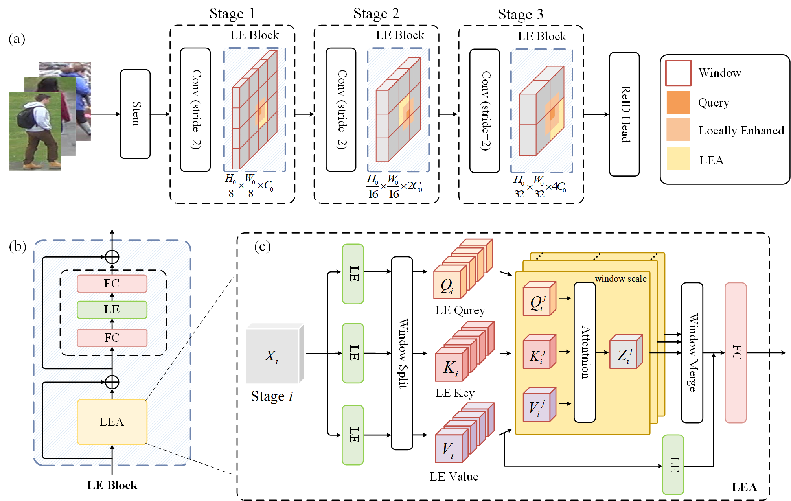
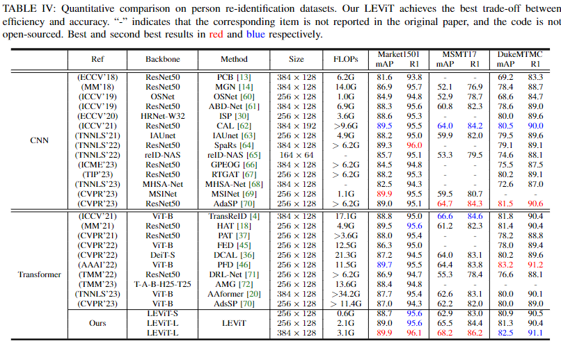
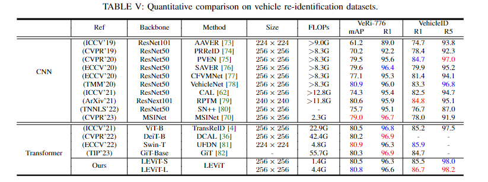

# LEViT
The official repository for LEViT: Locally Enhanced Vision Transformer for Efficient Object Re-identification.

## Architecture 


## Performance
### Person ReID

### Vehicle ReID



## Requirements
### Installation
```bash
pip install -r requirements.txt
```
### Prepare Datasets
Download the person datasets, vehicle datasets, and fine-grained Visual Categorization/Retrieval datasets.

Then unzip them and rename them under your "dataset_root" directory like
```bash
dataset_root
├── market1501
├── DukeMTMC-reID
├── MSMT17
├── VeRi
├── VehicleID_V1.0
├── CARS
├── CUB_200_2011
└── University-Release
```


## Training

### ImageNet Pretrained model
we prepared the ImageNet Pretrained LEViT backbone in "./network".

LEViT-S -> stem16_dim96_ratio1_layers474_heads124_ss777_dp005_vit110.pth

LEViT-L -> stem16_dim192_ratio1_layers474_heads248_ss777_dp010_vit110.pth


### Train on Market1501
LEViT-S with input of 256x128
```bash
python train.py --net small --img-height 256 --img-width 128 --batch-size 64 --lr 1.2e-1 --dataset market1501 --gpus 0,1 --epochs 5,75 --ema-ratio 0.80 --ema-extra 25 --instance-num 4 --erasing 0.45 --save-path params/ema.pth --dataset-root your/dataset_root
```
<font color=red>top1:0.956354 top5:0.982779 top10:0.990202 mAP:0.887031</font>

LEViT-L with input of 256x128
```bash
python train.py --net large --img-height 256 --img-width 128 --batch-size 64 --lr 1.2e-1 --dataset market1501 --gpus 0,1 --epochs 5,75 --ema-ratio 0.80 --ema-extra 25 --instance-num 4 --erasing 0.45 --save-path params/ema.pth --dataset-root your/dataset_root
```
<font color=red>top1:0.956354 top5:0.983967 top10:0.990499 mAP:0.890475</font>

LEViT-L with input of 384x128
```bash
python train.py --net large --img-height 384 --img-width 128 --batch-size 64 --lr 1.2e-1 --dataset market1501 --gpus 0,1 --epochs 5,75 --ema-ratio 0.80 --ema-extra 25 --instance-num 4 --erasing 0.45 --save-path params/ema.pth --dataset-root your/dataset_root
```
<font color=red>top1:0.960511 top5:0.983670 top10:0.990202 mAP:0.899444</font>

### Train on MSMT17
LEViT-S with input of 256x128
```bash
python train.py --net small --img-height 256 --img-width 128 --batch-size 64 --lr 1.2e-1 --dataset msmt17 --gpus 0,1 --epochs 5,75 --ema-ratio 0.80 --ema-extra 25 --instance-num 4 --erasing 0.45 --freeze stem --save-path params/ema.pth --dataset-root your/dataset_root
```
<font color=red>top1:0.829659 top5:0.908997 top10:0.933442 mAP:0.629266</font>


LEViT-L with input of 256x128
```bash
python train.py --net large --img-height 256 --img-width 128 --batch-size 64 --lr 1.2e-1 --dataset msmt17 --gpus 0,1 --epochs 5,75 --ema-ratio 0.80 --ema-extra 25 --instance-num 4 --erasing 0.45 --freeze stem --save-path params/ema.pth --dataset-root your/dataset_root
```
<font color=red>top1:0.844155 top5:0.916545 top10:0.937902 mAP:0.654685</font>

LEViT-L with input of 384x128
```bash
python train.py --net large --img-height 384 --img-width 128 --batch-size 64 --lr 1.2e-1 --dataset msmt17 --gpus 0,1 --epochs 5,75 --ema-ratio 0.80 --ema-extra 25 --instance-num 4 --erasing 0.45 --freeze stem --save-path params/ema.pth --dataset-root your/dataset_root
```
<font color=red>top1:0.862338 top5:0.928639 top10:0.946393 mAP:0.681992</font>

### Train on DukeMTMC
LEViT-S with input of 256x128
```bash
python train.py --net small --img-height 256 --img-width 128 --batch-size 64 --lr 1.2e-1 --dataset dukemtmc --gpus 0,1 --epochs 5,75 --ema-ratio 0.80 --ema-extra 25 --instance-num 4 --erasing 0.45 --save-path params/ema.pth  --dataset-root your/dataset_root
```
<font color=red>top1:0.904847 top5:0.954219 top10:0.969031 mAP:0.808951</font>

LEViT-L with input of 256x128
```bash
python train.py --net large --img-height 256 --img-width 128 --batch-size 64 --lr 1.2e-1 --dataset dukemtmc --gpus 0,1 --epochs 5,75 --ema-ratio 0.80 --ema-extra 25 --instance-num 4 --erasing 0.45 --save-path params/ema.pth  --dataset-root your/dataset_root
```
<font color=red>top1:0.903950 top5:0.954219 top10:0.964093 mAP:0.812532</font>

LEViT-L with input of 384x128
```bash
python train.py --net large --img-height 384 --img-width 128 --batch-size 64 --lr 1.2e-1 --dataset dukemtmc --gpus 0,1 --epochs 5,75 --ema-ratio 0.80 --ema-extra 25 --instance-num 4 --erasing 0.45 --freeze stem --save-path params/ema.pth  --dataset-root your/dataset_root
```
<font color=red>top1:0.911131 top5:0.955117 top10:0.968582 mAP:0.825202</font>


###  Train on VeRi776
LEViT-S
```bash
python train.py --net small --img-height 256 --img-width 256 --batch-size 64 --lr 1.2e-1 --dataset veri776 --gpus 0,1 --epochs 5,75 --ema-ratio 0.80 --ema-extra 25 --instance-num 4 --erasing 0.45 --freeze stem --save-path params/ema.pth --dataset-root your/dataset_root
```
<font color=red>top1:0.963051 top5:0.985697 top10:0.993445 mAP:0.804787</font>

LEViT-L
```bash
python train.py --net large --img-height 256 --img-width 256 --batch-size 64 --lr 1.2e-1 --dataset veri776 --gpus 0,1 --epochs 5,75 --ema-ratio 0.80 --ema-extra 25 --instance-num 4 --erasing 0.45 --freeze stem,layer1 --save-path params/ema.pth --dataset-root your/dataset_root
```
<font color=red>top1:0.966031 top5:0.984505 top10:0.990465 mAP:0.808354</font>


### Train on VehicleID
LEViT-S
```bash
python train.py--net small --img-height 256 --img-width 256 --batch-size 256 --lr 2.0e-1 --dataset vehicleid --gpus 0,1 --epochs 5,75 --ema-ratio 0.80 --ema-extra 25 --instance-num 4 --erasing 0.45 --save-path params/ema.pth --dataset-root your/dataset_root
```
<font color=red>top1:0.854910 top5:0.979624 top10:0.991920 mAP:0.882481</font>

LEViT-L
```bash
python train.py --net large --img-height 256 --img-width 256 --batch-size 256 --lr 2.0e-1 --dataset vehicleid --gpus 0,1 --epochs 5,75 --ema-ratio 0.80 --ema-extra 25 --instance-num 4 --erasing 0.45 --save-path params/ema.pth --dataset-root your/dataset_root
```
<font color=red>top1:0.866678 top5:0.981732 top10:0.991569 mAP:0.892321</font>

### Train on cars196
LEViT-S
```bash
python train.py --net small --img-height 256 --img-width 256 --batch-size 48 --lr 4.0e-2 --dataset car196 --gpus 0,1 --epochs 5,55 --ema-ratio 0.80 --ema-extra 25 --instance-num 6 --erasing 0.20 --save-path params/ema.pth --dataset-root your/dataset_root
```
<font color=red>Recall@1:0.938015 Recall@2:0.966056 Recall@4:0.978354 Recall@8:0.987209 NMI:0.822265</font>

LEViT-L
```bash
python train.py --net large --img-height 256 --img-width 256 --batch-size 48 --lr 4.0e-2 --dataset car196 --gpus 0,1 --epochs 5,55 --ema-ratio 0.80 --ema-extra 25 --instance-num 6 --erasing 0.20 --save-path params/ema.pth --dataset-root your/dataset_root
```
<font color=red>Recall@1:0.942443 Recall@2:0.969622 Recall@4:0.981183 Recall@8:0.988439 NMI:0.825822</font>

### Train on cub200
LEViT-S
```bash
python train.py --net small --img-height 256 --img-width 256 --batch-size 48 --lr 4.0e-2 --dataset cub200 --gpus 0,1 --epochs 5,55 --ema-ratio 0.80 --ema-extra 25 --instance-num 6 --erasing 0.20
```
<font color=red>Recall@1:0.707968 Recall@2:0.808069 Recall@4:0.878123 Recall@8:0.926401 NMI:0.746709</font>


LEViT-L
```bash
python train.py --net large --img-height 256 --img-width 256 --batch-size 48 --lr 4.0e-2 --dataset cub200 --gpus 0,1 --epochs 5,55 --ema-ratio 0.80 --ema-extra 25 --instance-num 6 --erasing 0.20
```
<font color=red>Recall@1:0.731263 Recall@2:0.819548 Recall@4:0.888926 Recall@8:0.931803 NMI:0.751080</font>

### Train on University1652
LEViT-S
```bash
python train.py --net small --img-height 384 --img-width 384 --batch-size 48 --lr 1.5e-1 --dataset university1652 --gpus 2,3 --epochs 5,15 --ema-ratio 0.80 --ema-extra 15 --instance-num 6 --erasing 0.10
```
<font color=red>top1:0.912981 top5:0.934379 top10:0.941512 mAP:0.872820</font>

LEViT-L
```bash
python train.py --net large --img-height 384 --img-width 384 --batch-size 48 --lr 1.5e-1 --dataset university1652 --gpus 0,1 --epochs 5,15 --ema-ratio 0.80 --ema-extra 15 --instance-num 6 --erasing 0.10
```
<font color=red>top1:0.925820 top5:0.940086 top10:0.945792 mAP:0.894554</font>


## Evaluation
Take market1501 as an example, others are similar
### Market1501
After training the model:

revise test_market1501.py (line18 for input size, line37 and line105 for model type) 

then run
```bash
python test_market1501.py
```


## Contact
If you have any questions, please contact us by email(wangyh99@stu.xjtu.edu.cn).

