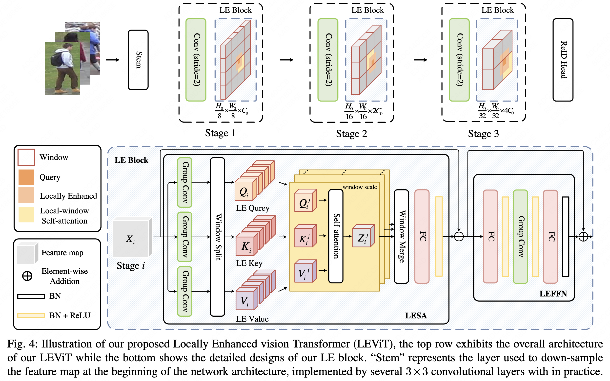

# LEViT
LEViT: Locally Enhanced Vision Transformer for Efficient Object Re-identification.

## Architecture 


## Prepare Market1501 dataset
1. Download the person datasets [Market1501](https://zheng-lab.cecs.anu.edu.au/Project/project_reid.html) to "./dataset" folder

Then unzip them and rename them under the directory like
```
dataset
├── Market-1501-v15.09.15.zip
├── market1501.py
```

2. Use our script to generate the "train.txt" file
```bash
cd dataset
python market1501.py
```

## ImageNet Pretrained model
we prepared the ImageNet Pretrained LEViT backbone in "./network/"
LEViT-S and LEViT-L correspond to "stem16_dim96_ratio1_layers474_heads124_ss777_dp005_vit110.pth" and "stem16_dim192_ratio1_layers474_heads248_ss777_dp010_vit110.pth" respectively

## Train with LEViT
LEViT-S with input of 256x128
```bash
python train.py --model dbn --net small --img-height 256 --img-width 128 --batch-size 64 --lr 1.5e-1 --dataset market1501 --gpus 0,1 --swa True --swa-ratio 0.80 --swa-extra 25
```

LEViT-S with input of 384x128
```bash
python train.py --model dbn --net small --img-height 384 --img-width 128 --batch-size 64 --lr 1.5e-1 --dataset market1501 --gpus 0,1 --swa True --swa-ratio 0.80 --swa-extra 25
```

LEViT-L with input of 384x128
```bash
python train.py --model dbn --net large --img-height 384 --img-width 128 --batch-size 64 --lr 1.5e-1 --dataset market1501 --gpus 0,1 --swa True --swa-ratio 0.80 --swa-extra 25
```

the trained model will be saved in the "./params/" directory

## Evaluation
Run directly after training the model:
```bash
python train.py --model dbn --net large --img-height 384 --img-width 128 --batch-size 64 --lr 1.5e-1 --dataset market1501 --gpus 0,1 --swa True --swa-ratio 0.80 --swa-extra 25
```

## Contact
If you have any questions, please contact us by email(wangyh99@stu.xjtu.edu.cn).

